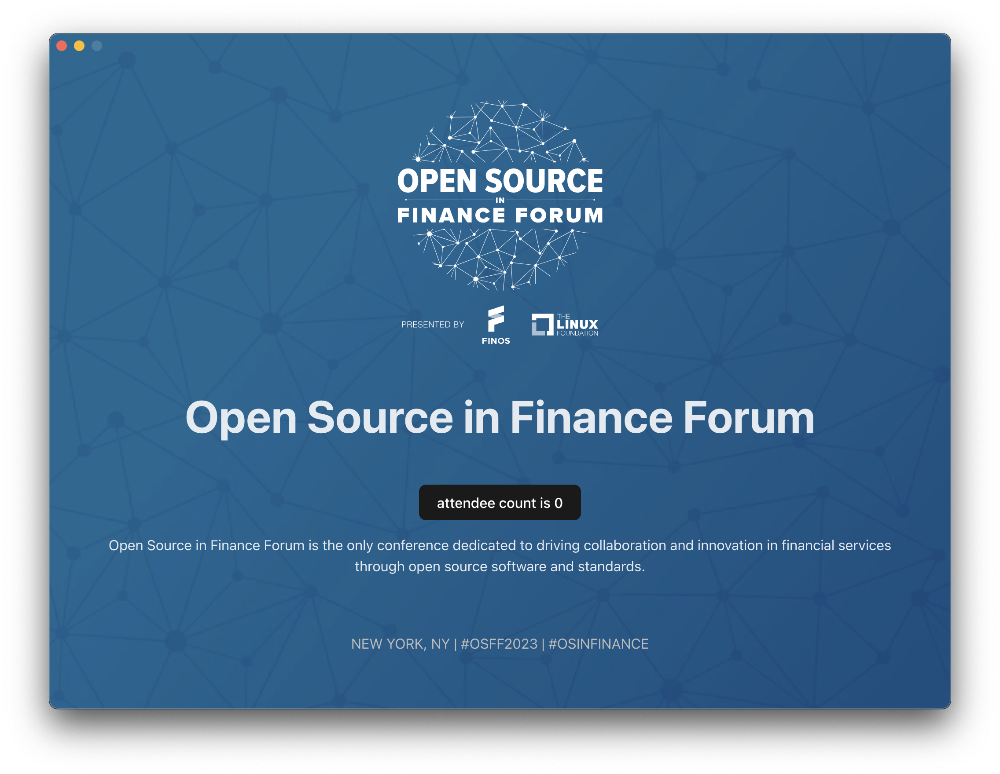

<center>
  
</center>

# Bolilerplate Electron Application with Test Automation

This is a guinea pig application to showcase how to do ["Automated Testing of Electron Applications using WebdriverIO"](https://sched.co/1Q1Fa)

## Quick Start

Do follow allong during the session:

1. clone the git repo

2. Install dependencies, via:

```sh
npm install
```

3. Manually test the application first:

```sh
npm start
```

4. Pay attention!
